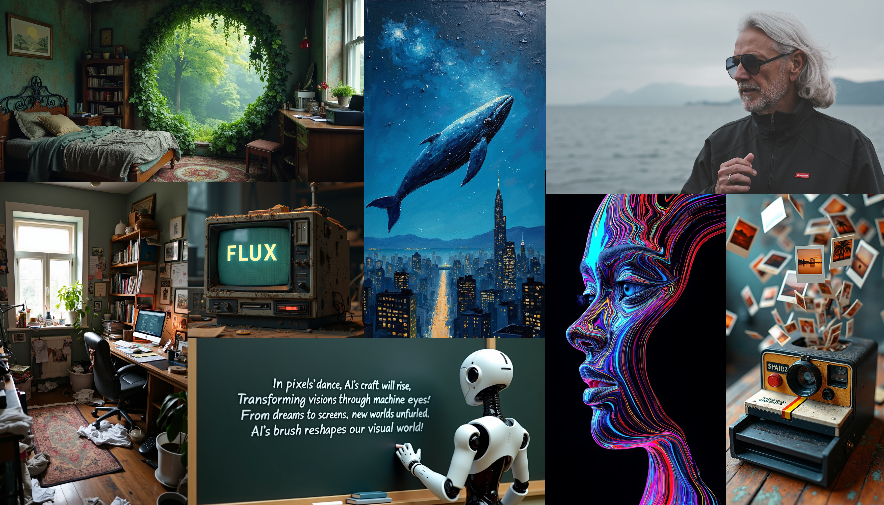

# FLUX
by Black Forest Labs: https://bfl.ai.

Documentation for our API can be found here: [docs.bfl.ai](https://docs.bfl.ai/).



This repo contains minimal inference code to run image generation & editing with our Flux open-weight models.

## Local installation

```bash
cd $HOME && git clone https://github.com/black-forest-labs/flux
cd $HOME/flux
python3.10 -m venv .venv
source .venv/bin/activate
pip install -e ".[all]"
```

### Local installation with TensorRT support

If you would like to install the repository with [TensorRT](https://github.com/NVIDIA/TensorRT) support, you currently need to install a PyTorch image from NVIDIA instead. First install [enroot](https://github.com/NVIDIA/enroot), next follow the steps below:

```bash
cd $HOME && git clone https://github.com/black-forest-labs/flux
enroot import 'docker://$oauthtoken@nvcr.io#nvidia/pytorch:25.01-py3'
enroot create -n pti2501 nvidia+pytorch+25.01-py3.sqsh
enroot start --rw -m ${PWD}/flux:/workspace/flux -r pti2501
cd flux
pip install -e ".[tensorrt]" --extra-index-url https://pypi.nvidia.com
```

### Open-weight models

We are offering an extensive suite of open-weight models. For more information about the individual models, please refer to the link under **Usage**.

| Name                        | Usage                                                      | HuggingFace repo                                               | License                                                               |
| --------------------------- | ---------------------------------------------------------- | -------------------------------------------------------------- | --------------------------------------------------------------------- |
| `FLUX.1 [schnell]`          | [Text to Image](docs/text-to-image.md)                     | https://huggingface.co/black-forest-labs/FLUX.1-schnell        | [apache-2.0](model_licenses/LICENSE-FLUX1-schnell)                    |
| `FLUX.1 [dev]`              | [Text to Image](docs/text-to-image.md)                     | https://huggingface.co/black-forest-labs/FLUX.1-dev            | [FLUX.1-dev Non-Commercial License](model_licenses/LICENSE-FLUX1-dev) |
| `FLUX.1 Fill [dev]`         | [In/Out-painting](docs/fill.md)                            | https://huggingface.co/black-forest-labs/FLUX.1-Fill-dev       | [FLUX.1-dev Non-Commercial License](model_licenses/LICENSE-FLUX1-dev) |
| `FLUX.1 Canny [dev]`        | [Structural Conditioning](docs/structural-conditioning.md) | https://huggingface.co/black-forest-labs/FLUX.1-Canny-dev      | [FLUX.1-dev Non-Commercial License](model_licenses/LICENSE-FLUX1-dev) |
| `FLUX.1 Depth [dev]`        | [Structural Conditioning](docs/structural-conditioning.md) | https://huggingface.co/black-forest-labs/FLUX.1-Depth-dev      | [FLUX.1-dev Non-Commercial License](model_licenses/LICENSE-FLUX1-dev) |
| `FLUX.1 Canny [dev] LoRA`   | [Structural Conditioning](docs/structural-conditioning.md) | https://huggingface.co/black-forest-labs/FLUX.1-Canny-dev-lora | [FLUX.1-dev Non-Commercial License](model_licenses/LICENSE-FLUX1-dev) |
| `FLUX.1 Depth [dev] LoRA`   | [Structural Conditioning](docs/structural-conditioning.md) | https://huggingface.co/black-forest-labs/FLUX.1-Depth-dev-lora | [FLUX.1-dev Non-Commercial License](model_licenses/LICENSE-FLUX1-dev) |
| `FLUX.1 Redux [dev]`        | [Image variation](docs/image-variation.md)                 | https://huggingface.co/black-forest-labs/FLUX.1-Redux-dev      | [FLUX.1-dev Non-Commercial License](model_licenses/LICENSE-FLUX1-dev) |
| `FLUX.1 Kontext [dev]`      | [Image editing](docs/image-editing.md)                     | https://huggingface.co/black-forest-labs/FLUX.1-Kontext-dev    | [FLUX.1-dev Non-Commercial License](model_licenses/LICENSE-FLUX1-dev) |
| `FLUX.1 Krea [dev]`         | [Text to Image](docs/text-to-image.md)                     | https://huggingface.co/black-forest-labs/FLUX.1-Krea-dev       | [FLUX.1-dev Non-Commercial License](model_licenses/LICENSE-FLUX1-dev) |

The weights of the autoencoder are also released under [apache-2.0](https://huggingface.co/datasets/choosealicense/licenses/blob/main/markdown/apache-2.0.md) and can be found in the HuggingFace repos above.

## API usage

Our API offers access to all models including our Pro tier non-open weight models. Check out our API documentation [docs.bfl.ai](https://docs.bfl.ai/) to learn more.

## Licensing models for commercial use

You can license our models for commercial use here: https://bfl.ai/pricing/licensing

As the fee is based on a monthly usage, we provide code to automatically track your usage via the BFL API. To enable usage tracking please select *track_usage* in the cli or click the corresponding checkmark in our provided demos.

### Example: Using FLUX.1 Kontext with usage tracking

We provide a reference implementation for running FLUX.1 with usage tracking enabled for commercial licensing.
This can be customized as needed as long as the usage reporting is accurate.

For the reporting logic to work you will need to set your API key as an environment variable before running:
```bash
export BFL_API_KEY="your_api_key_here"
```

You can call `FLUX.1 Kontext [dev]` like this with tracking activated:

```bash
python -m flux kontext --track_usage --loop
```

For a single generation:

```bash
python -m flux kontext --track_usage --prompt "replace the logo with the text 'Black Forest Labs'"
```

The above reporting logic works similarly for FLUX.1 [dev] and FLUX.1 Tools [dev].

**Note that this is only required when using one or more of our open weights models commercially. More information on the commercial licensing can be found at the [BFL Helpdesk](https://help.bfl.ai/collections/6939000511-licensing).**


## Citation

If you find the provided code or models useful for your research, consider citing them as:

```bib
@misc{labs2025flux1kontextflowmatching,
      title={FLUX.1 Kontext: Flow Matching for In-Context Image Generation and Editing in Latent Space},
      author={Black Forest Labs and Stephen Batifol and Andreas Blattmann and Frederic Boesel and Saksham Consul and Cyril Diagne and Tim Dockhorn and Jack English and Zion English and Patrick Esser and Sumith Kulal and Kyle Lacey and Yam Levi and Cheng Li and Dominik Lorenz and Jonas Müller and Dustin Podell and Robin Rombach and Harry Saini and Axel Sauer and Luke Smith},
      year={2025},
      eprint={2506.15742},
      archivePrefix={arXiv},
      primaryClass={cs.GR},
      url={https://arxiv.org/abs/2506.15742},
}

@misc{flux2024,
    author={Black Forest Labs},
    title={FLUX},
    year={2024},
    howpublished={\url{https://github.com/black-forest-labs/flux}},
}
```
