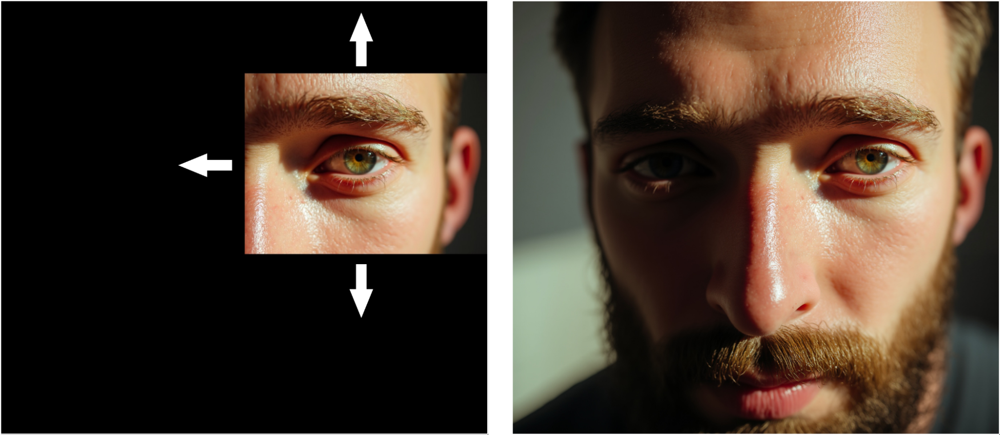

## Open-weight models

FLUX.1 Fill introduces advanced inpainting and outpainting capabilities. It allows for seamless edits that integrate naturally with existing images.

| Name                | HuggingFace repo                                         | License                                                               | sha256sum                                                        |
| ------------------- | -------------------------------------------------------- | --------------------------------------------------------------------- | ---------------------------------------------------------------- |
| `FLUX.1 Fill [dev]` | https://huggingface.co/black-forest-labs/FLUX.1-Fill-dev | [FLUX.1-dev Non-Commercial License](model_licenses/LICENSE-FLUX1-dev) | 03e289f530df51d014f48e675a9ffa2141bc003259bf5f25d75b957e920a41ca |

## Examples




## Open-weights usage

The weights will be downloaded automatically to `checkpoints/` from HuggingFace once you start one of the demos. Alternatively, you may download the weights manually and put them in `checkpoints/`, or you can also manually link them with the following environment variables:
```bash
export FLUX_MODEL=<your model path here>
export FLUX_AE=<your autoencoder path here>
```

For interactive sampling run

```bash
python -m flux fill --loop
```

Or to generate a single sample run

```bash
python -m flux fill \
  --img_cond_path <path_to_input_image> \
  --img_mask_path <path_to_input_mask>
```

The input_mask should be an image of the same size as the conditioning image that only contains black and white pixels; see [an example mask](../assets/cup_mask.png) for [this image](../assets/cup.png).

We also provide an interactive streamlit demo. The demo can be run via

```bash
streamlit run demo_st_fill.py
```
